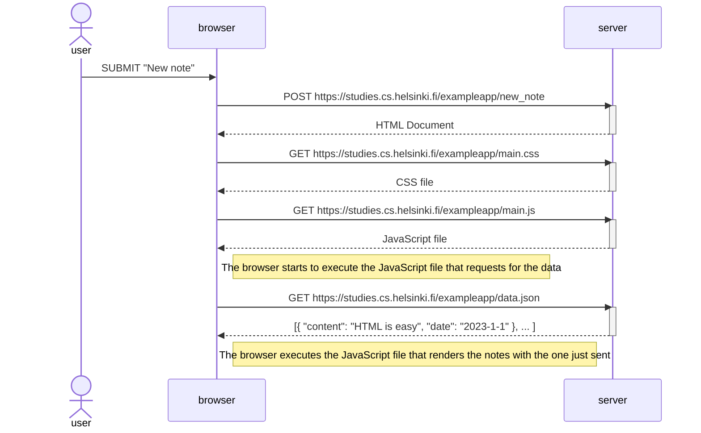

# New note diagram

```mermaid
        sequenceDiagram
                actor user
                participant browser
                participant server

                user->>browser: SUBMIT "New note"
                browser->>server: POST https://studies.cs.helsinki.fi/exampleapp/new_note
                activate server
                server-->>browser: HTML Document
                deactivate server

                browser->>server: GET https://studies.cs.helsinki.fi/exampleapp/main.css
                activate server
                server-->>browser: CSS file
                deactivate server

                browser->>server: GET https://studies.cs.helsinki.fi/exampleapp/main.js
                activate server
                server-->>browser: JavaScript file
                deactivate server

                Note right of browser: The browser starts to execute the JavaScript file that requests for the data

                browser->>server: GET https://studies.cs.helsinki.fi/exampleapp/data.json
                activate server
                server-->>browser: [{ "content": "HTML is easy", "date": "2023-1-1" }, ... ]
                deactivate server

                Note right of browser: The browser executes the JavaScript file that renders the notes with the one just sent
```
